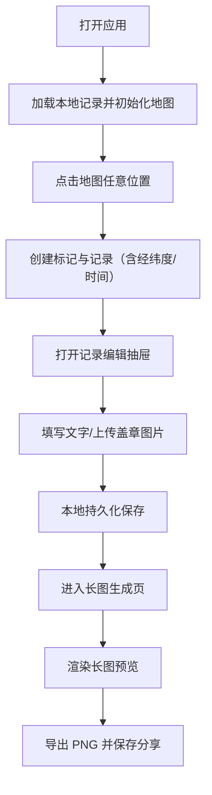

## 1. 产品概述
一个极简的「旅游盖章收集」Web App：在地图上点选地点添加“盖章记录”，为每条记录写下文字并上传盖章图片；所有记录可一键生成可分享的长图拼图，并在本地离线保存。

## 2. 核心功能

### 2.1 用户角色
本产品不区分角色，默认单用户离线使用。

### 2.2 功能模块
1. **地图采集页**：高德地图展示、点击添加标记、记录列表、记录编辑抽屉
2. **长图生成页**：生成长条拼图长图、保存到手机、基础排版与导出质量选项
3. **设置页（轻量）**：数据管理（导出/导入 JSON、清空本地数据）、隐私说明

### 2.3 页面明细
| 页面名称 | 模块名称 | 功能描述 |
|---|---|---|
| 地图采集页 | 地图容器 | 使用高德地图 Web JS API，支持拖动、缩放、基础控件（缩放/定位） |
| 地图采集页 | 点选添加 | 点击地图任意位置添加标记点（含经纬度），自动写入创建时间 |
| 地图采集页 | 标记交互 | 点击标记打开记录编辑抽屉；可删除标记 |
| 地图采集页 | 记录编辑抽屉 | 编辑标题/地点名、文字记录；上传 1~N 张盖章图片（压缩/限制大小）；显示时间与坐标 |
| 地图采集页 | 记录列表 | 按时间倒序展示；快速定位到地图标记；搜索（按标题/内容） |
| 长图生成页 | 长图预览 | 以“章”为单位的竖向条幅排版：标题、时间、地点、文字、图片网格 |
| 长图生成页 | 一键导出 | 将长图渲染为图片（PNG），触发下载/保存；移动端以长按保存为目标 |
| 长图生成页 | 导出参数 | 分辨率倍率（1x/2x）、背景色（淡蓝/淡紫）与边距密度开关 |
| 设置页 | 导出/导入 | 导出为 JSON（含图片 Base64 或 Blob 引用策略）；导入后覆盖或合并 |
| 设置页 | 清空数据 | 二次确认后清空本地数据 |
| 设置页 | 隐私说明 | 明确离线本地保存、不上传服务器 |

## 3. 核心流程
用户打开应用 → 在地图上点选地点 → 自动生成一条记录并落点 → 打开抽屉填写文字/上传图片 → 本地保存 → 进入长图生成页 → 一键生成并保存分享。

## 4. 用户界面设计

### 4.1 设计风格（INTJ 高智极简风）
- 关键词：冷淡、高智感、秩序、克制、结构清晰、无冗余
- 色彩：莫兰迪淡蓝 + 淡紫为主，低饱和，整体偏冷；强调色只用于“保存/导出”等关键动作
- 形态：纤细边框、弱阴影或无阴影、留白充足；圆角克制（2–6px）
- 字体：中文优先使用「思源黑体 / Source Han Sans SC」风格的无衬线体系；英文字体选用「IBM Plex Sans」风格（避免过度流行的默认方案）
- 图标：线性几何 SVG 图标，统一笔画 1.5px，尽量单色
- 动效：不做花哨动画，仅保留必要的状态过渡（150–220ms，ease-out）

### 4.2 页面设计概览
| 页面名称 | 模块名称 | UI 元素 |
|---|---|---|
| 地图采集页 | 顶部栏 | 左：产品名；右：导出/设置入口；底色淡蓝紫渐变（极浅） |
| 地图采集页 | 地图 | 全屏主视觉；控件统一线性、半透明冷灰底 |
| 地图采集页 | 底部列表 | 极简列表：标题、时间、缩略图；点击定位；支持收起 |
| 地图采集页 | 编辑抽屉 | 细边框、清晰层级：标题/文本/图片/删除；主按钮强调但克制 |
| 长图生成页 | 预览区 | 竖向条幅：顶部标题区 + 记录卡片序列；卡片保持统一网格与间距 |
| 长图生成页 | 导出区 | 倍率选择、主题色切换、导出按钮；给出“导出后到相册保存”提示 |
| 设置页 | 数据管理 | 导出/导入/清空三段式；危险操作用更轻但明确的警示色 |

### 4.3 响应式
- 桌面优先布局，移动端自适应：
  - 地图页：底部列表与抽屉在移动端更贴合拇指区域
  - 长图页：预览区域可滚动，导出按钮固定在底部
  - 触控优化：按钮高度 40–44px，间距更克制但避免误触

