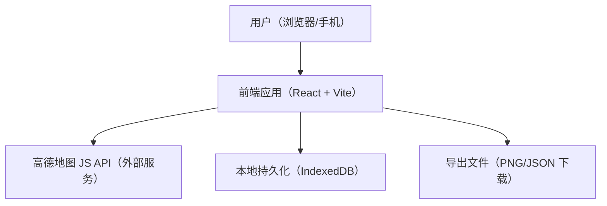
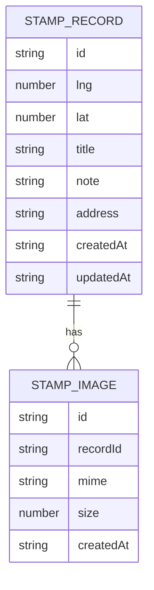

## 1. 架构设计

设计原则：
- 纯前端离线优先：不引入后端与第三方存储服务
- 数据本地保存：文字 + 经纬度 + 时间 + 图片（Blob）保存在 IndexedDB
- 导出长图：前端将“长图容器”渲染为 Canvas 后导出 PNG

## 2. 技术选型说明
- 前端：React@18 + TypeScript + Vite
- 样式：Tailwind CSS（以 CSS 变量约束色板与间距，确保极简一致）
- 地图：高德地图 Web JS API（通过 `<script>` 引入）
- 本地存储：IndexedDB（手写轻量封装，不依赖额外库）
- 长图导出：html2canvas（将 DOM 渲染为 Canvas 并导出 PNG）

## 3. 路由定义
| 路由 | 用途 |
|---|---|
| / | 地图采集页（默认） |
| /export | 长图生成页 |
| /settings | 设置页 |

## 4. API 定义
无后端 API。

## 5. 数据模型

### 5.1 数据模型定义

### 5.2 IndexedDB 结构
- 数据库名：`stamp-atlas`
- 版本：`1`
- Object Stores：
  - `records`：keyPath `id`；索引 `createdAt`、`updatedAt`
  - `images`：keyPath `id`；索引 `recordId`
- 图片存储：
  - `images` store 内保存 `Blob`（字段 `blob`），避免 base64 膨胀
  - UI 展示时使用 `URL.createObjectURL(blob)`，离开页面时及时 `revokeObjectURL`

## 6. 关键实现点
- 高德地图加载：在 `index.html` 通过脚本标签加载 API；应用启动后初始化地图实例
- 标记点：点击地图事件回调中创建记录与 marker；marker id 与 record id 绑定
- 编辑抽屉：使用受控表单；保存时更新 IndexedDB；图片上传进行尺寸/大小限制与必要压缩
- 长图导出：导出页渲染统一卡片列表；调用 html2canvas 以倍率输出；生成 `a` 标签下载
- 可用性：离线打开仍可浏览既有记录；错误提示不打扰（冷静克制的 toast）

